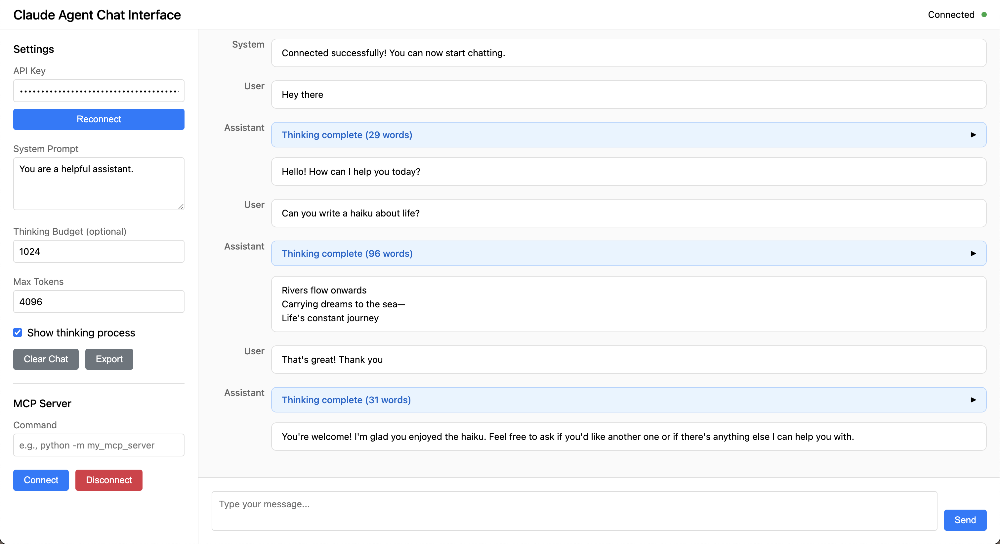

# Claude Agent

A minimal Python implementation of a Claude-based agent with MCP (Model Context Protocol) support and extended thinking capabilities. Built using Test-Driven Development methodology with comprehensive test coverage.

## Features

- 🚀 **Streaming Responses**: Real-time token streaming via Server-Sent Events (SSE)
- 🧠 **Extended Thinking**: Support for Claude's extended thinking mode with separate thinking/response token classification
- 🔧 **MCP Integration**: Connect to local MCP servers via stdio transport
- 💬 **Conversation History**: Maintain context across multiple interactions
- 🌐 **Web Chat Interface**: User-friendly browser interface with real-time streaming
- 🎯 **Type-Safe**: Full type hints throughout the codebase
- ✅ **Test-Driven**: Comprehensive test coverage using TDD methodology

## Installation

```bash
# Clone the repository
git clone <repository-url>
cd claude_agent

# Create virtual environment
python3 -m venv venv
source venv/bin/activate  # On Windows: venv\Scripts\activate

# Install in development mode
pip install -e ".[dev]"
```

## Quick Start

### Option 1: Web Chat Interface

```bash
# Run the chat interface
python run_chat.py

# Opens browser at http://localhost:8080
# Enter your API key in the web interface
```

### Option 2: Programmatic Usage

```python
import asyncio
from claude_agent.agent import ClaudeAgent, StreamEventType

async def main():
    # Initialize agent
    agent = ClaudeAgent(api_key="your-api-key")
    
    # Stream a response
    async for event in agent.stream_response(
        system_prompt="You are a helpful assistant.",
        user_prompt="Hello, how are you?"
    ):
        if event.type == StreamEventType.RESPONSE:
            print(event.content, end="", flush=True)

asyncio.run(main())
```

## Web Chat Interface



The included web interface provides an easy way to test and interact with the Claude agent:

- **BYOK Support**: Enter your Anthropic API key directly in the interface
- **Real-time Streaming**: See responses as they're generated
- **Extended Thinking**: Toggle thinking mode with collapsible thinking process display
- **MCP Server Connection**: Connect to any MCP server from the UI
- **Conversation History**: Full history with export functionality
- **Persistent Settings**: Your preferences are saved locally

See [CHAT_INTERFACE_README.md](CHAT_INTERFACE_README.md) for detailed documentation.

## Extended Thinking Mode

Enable Claude's extended thinking for complex reasoning tasks:

```python
async for event in agent.stream_response(
    system_prompt="You are a math tutor.",
    user_prompt="Solve this complex problem...",
    thinking_budget=10000,  # Tokens for thinking
    max_tokens=20000       # Total max tokens
):
    if event.type == StreamEventType.THINKING:
        print(f"[Thinking] {event.content}")
    elif event.type == StreamEventType.RESPONSE:
        print(event.content, end="")
```

## MCP Integration

Connect to MCP servers for external tool access. Claude can automatically use tools from any MCP server! See [MCP_INTEGRATION.md](MCP_INTEGRATION.md) for detailed guide.

```python
from claude_agent.agent_tools_fixed import ClaudeAgentWithToolsFixed, StreamEventType

# Initialize agent with tool support
agent = ClaudeAgentWithToolsFixed(api_key="your-api-key")

# Connect to any MCP server (filesystem example)
await agent.connect_mcp(
    command="npx",
    args=["-y", "@modelcontextprotocol/server-filesystem", "/path/to/files"]
)

# Claude automatically uses tools to answer questions!
async for event in agent.stream_response_with_tools(
    system_prompt="You are a helpful assistant with filesystem access.",
    user_prompt="What files are in this directory and what do they contain?"
):
    if event.type == StreamEventType.RESPONSE:
        print(event.content, end="")
    elif event.type == StreamEventType.TOOL_USE:
        print(f"\n[Using tool: {event.metadata.get('tool_name')}]")

# Works with any MCP server - YouTube, GitHub, SQLite, etc!
await agent.connect_mcp(
    command="npx",
    args=["-y", "@smithery/cli", "run", "@kimtaeyoon83/mcp-server-youtube-transcript"]
)

# Claude can now analyze YouTube videos
async for event in agent.stream_response_with_tools(
    system_prompt="You are a helpful assistant.",
    user_prompt="Summarize this video: https://youtube.com/watch?v=..."
):
    print(event.content, end="")

# Disconnect when done
await agent.disconnect_mcp()
```

## Architecture

The agent follows a modular design with clear separation of concerns:

- **SSE Parser**: Handles Server-Sent Events parsing with buffering support
- **Token Classifier**: Classifies tokens as thinking or response based on content blocks
- **MCP Client**: Manages connections to Model Context Protocol servers
- **API Request Builder**: Constructs properly formatted API requests
- **Agent Core**: Orchestrates all components for seamless streaming

## Running Tests

```bash
# Run all tests
pytest

# Run with coverage
pytest --cov=claude_agent

# Run specific test file
pytest tests/test_sse_parser.py -v
```

## Development

This project follows Test-Driven Development (TDD) principles. When adding new features:

1. Write tests first
2. Run tests to see them fail
3. Implement the feature
4. Run tests to see them pass
5. Refactor if needed

## Requirements

- Python 3.9+
- httpx for async HTTP requests
- mcp for Model Context Protocol support
- pytest for testing

## License

MIT License - See LICENSE file for details